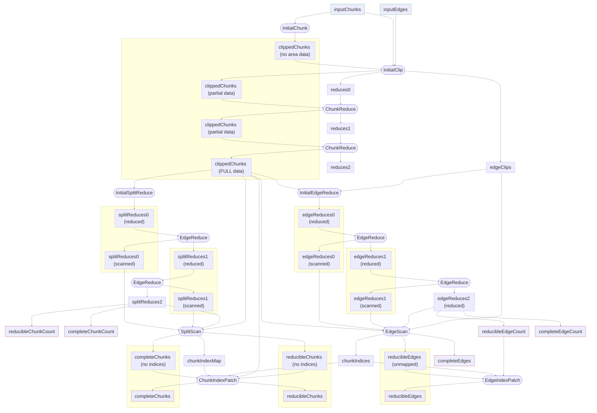

```mermaid
flowchart TD
    
    classDef default font-size:40px
    
    classDef outputClass stroke:#a00, font-size:40px
    classDef inputClass stroke:#0a0, font-size:40px
    classDef hideClass fill:transparent, stroke:transparent
    
    inputChunks["inputChunks"]:::inputClass
    inputEdges["inputEdges"]:::inputClass
    
    subgraph inputs [" "]
        inputChunks
        inputEdges
    end
    class inputs hideClass

    inputChunks --> InitialChunk([InitialChunk])
    InitialChunk --> clippedChunks0
    
    clippedChunks0["clippedChunks (no area data)"]
    clippedChunks1["clippedChunks (partial data)"]
    clippedChunks2["clippedChunks (partial data)"]
    clippedChunks3["clippedChunks (FULL data)"]

    subgraph clippedChunks [" "]
        clippedChunks0
        clippedChunks1
        clippedChunks2
        clippedChunks3
    end

    inputChunks & inputEdges & clippedChunks0 --> InitialClip([InitialClip])
    InitialClip --> clippedChunks1 & reduces0 & edgeClips

    clippedChunks1 & reduces0 --> ChunkReduce1([ChunkReduce]) --> reduces1 & clippedChunks2
    
    clippedChunks2 & reduces1 --> ChunkReduce2([ChunkReduce]) --> reduces2 & clippedChunks3

    clippedChunks3 & edgeClips --> InitialEdgeReduce([InitialEdgeReduce]) --> edgeReduces0reduce

    edgeReduces0reduce --> EdgeReduce1 --> edgeReduces0scan & edgeReduces1reduce

    edgeReduces1reduce --> EdgeReduce2 --> edgeReduces1scan & edgeReduces2reduce

    subgraph edgeCounts [" "]
        reducibleEdgeCount:::outputClass
        completeEdgeCount:::outputClass
    end
    class edgeCounts hideClass

    edgeReduces2reduce --> reducibleEdgeCount & completeEdgeCount

    clippedChunks3 & edgeReduces0scan & edgeReduces1scan & edgeReduces2reduce & edgeClips --> EdgeScan([EdgeScan])
    EdgeScan --> reducibleEdges0
    EdgeScan --> completeEdges
    EdgeScan --> chunkIndices

    chunkIndices & reducibleEdgeCount & reducibleEdges0 --> EdgeIndexPatch([EdgeIndexPatch]) --> reducibleEdges1

    clippedChunks3 --> InitialSplitReduce --> splitReduces0reduce
    splitReduces0reduce --> EdgeReduceX --> splitReduces0scan & splitReduces1reduce
    splitReduces1reduce --> EdgeReduceY --> splitReduces1scan & splitReduces2

    subgraph splits [" "]
        InitialSplitReduce([InitialSplitReduce])
    
        subgraph splitReduces0 [" "]
            splitReduces0reduce["splitReduces0 (reduced)"]
            splitReduces0scan["splitReduces0 (scanned)"]
        end
    
        subgraph splitReduces1 [" "]
            splitReduces1reduce["splitReduces1 (reduced)"]
            splitReduces1scan["splitReduces1 (scanned)"]
        end
        
        splitReduces2
        
        EdgeReduceX([EdgeReduce])
        EdgeReduceY([EdgeReduce])
    end
    class splits hideClass
    
    subgraph chunkCounts [" "]
        reducibleChunkCount:::outputClass
        completeChunkCount:::outputClass
    end
    class chunkCounts hideClass

    splitReduces2 --> reducibleChunkCount & completeChunkCount

    splitReduces0scan & splitReduces1scan & splitReduces2 & clippedChunks3 --> SplitScan([SplitScan])
    SplitScan --> reducibleChunks0
    SplitScan --> completeChunks0
    SplitScan --> chunkIndexMap

    reducibleChunks0 & completeChunks0 & chunkIndexMap & chunkIndices & clippedChunks3 --> ChunkIndexPatch([ChunkIndexPatch])
    ChunkIndexPatch --> reducibleChunks1:::outputClass & completeChunks1:::outputClass

    subgraph edges [" "]
        subgraph edgeReduces0 [" "]
            edgeReduces0reduce["edgeReduces0 (reduced)"]
            edgeReduces0scan["edgeReduces0 (scanned)"]
        end
        
        EdgeReduce1([EdgeReduce])
    
        subgraph edgeReduces1 [" "]
            edgeReduces1reduce["edgeReduces1 (reduced)"]
            edgeReduces1scan["edgeReduces1 (scanned)"]
        end
        
        EdgeReduce2([EdgeReduce])
        
        edgeReduces2reduce["edgeReduces2 (reduced)"]
    end
    class edges hideClass
    
    subgraph outputEdges [" "]
        subgraph reducibleEdges [" "]
            reducibleEdges0["reducibleEdges (unmapped)"]
            reducibleEdges1["reducibleEdges"]:::outputClass
        end
        
        completeEdges:::outputClass
    end
    class outputEdges hideClass

    subgraph reducibleChunks [" "]
        reducibleChunks0["reducibleChunks (no indices)"]
        reducibleChunks1["reducibleChunks"]
    end

    subgraph completeChunks [" "]
        completeChunks0["completeChunks (no indices)"]
        completeChunks1["completeChunks"]
    end
    
%%    subgraph outputs [" "]
%%        reducibleEdgeCount
%%        completeEdgeCount
%%        reducibleChunkCount
%%        completeChunkCount
%%        reducibleEdges1
%%        completeEdges
%%        reducibleChunks1
%%        completeChunks1
%%    end
%%    style outputs fill:transparent,stroke:transparent
```
