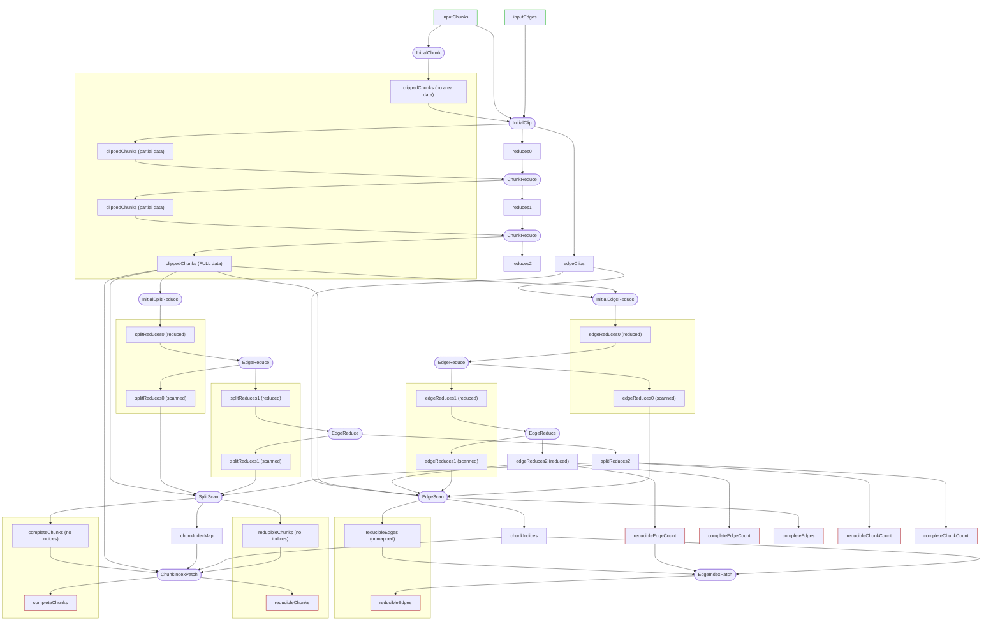

```mermaid
flowchart TD
    inputChunks["inputChunks"]:::inputClass
    inputEdges["inputEdges"]:::inputClass
    
    subgraph inputs [" "]
        inputChunks
        inputEdges
    end

    inputChunks --> InitialChunk([InitialChunk])
    InitialChunk --> clippedChunks0
    
    clippedChunks0["clippedChunks (no area data)"]
    clippedChunks1["clippedChunks (partial data)"]
    clippedChunks2["clippedChunks (partial data)"]
    clippedChunks3["clippedChunks (FULL data)"]

    subgraph clippedChunks [" "]
        clippedChunks0
        clippedChunks1
        clippedChunks2
        clippedChunks3
    end

    inputChunks & inputEdges & clippedChunks0 --> InitialClip([InitialClip])
    InitialClip --> edgeClips & reduces0 & clippedChunks1

    reduces0 & clippedChunks1 --> ChunkReduce1([ChunkReduce]) --> reduces1 & clippedChunks2
    
    reduces1 & clippedChunks2 --> ChunkReduce2([ChunkReduce]) --> reduces2 & clippedChunks3

    edgeClips & clippedChunks3 --> InitialEdgeReduce([InitialEdgeReduce]) --> edgeReduces0reduce

    edgeReduces0reduce --> EdgeReduce1([EdgeReduce]) --> edgeReduces1reduce & edgeReduces0scan

    edgeReduces1reduce --> EdgeReduce2([EdgeReduce]) --> edgeReduces2reduce & edgeReduces1scan

    edgeReduces2reduce["edgeReduces2 (reduced)"] --> reducibleEdgeCount:::outputClass & completeEdgeCount:::outputClass

    edgeClips & clippedChunks3 & edgeReduces2reduce & edgeReduces1scan & edgeReduces0scan --> EdgeScan([EdgeScan])
    EdgeScan --> reducibleEdges0 & completeEdges:::outputClass & chunkIndices

    reducibleEdges0 & reducibleEdgeCount & chunkIndices --> EdgeIndexPatch([EdgeIndexPatch]) --> reducibleEdges1:::outputClass

    clippedChunks3 --> InitialSplitReduce([InitialSplitReduce]) --> splitReduces0reduce
    splitReduces0reduce --> EdgeReduceX([EdgeReduce]) --> splitReduces0scan & splitReduces1reduce
    splitReduces1reduce --> EdgeReduceY([EdgeReduce]) --> splitReduces1scan & splitReduces2

    splitReduces2 --> reducibleChunkCount:::outputClass & completeChunkCount:::outputClass

    clippedChunks3 & splitReduces0scan & splitReduces1scan & splitReduces2 --> SplitScan([SplitScan])
    SplitScan --> reducibleChunks0 & completeChunks0 & chunkIndexMap

    clippedChunks3 & reducibleChunks0 & completeChunks0 & chunkIndexMap & chunkIndices --> ChunkIndexPatch([ChunkIndexPatch])
    ChunkIndexPatch --> reducibleChunks1:::outputClass & completeChunks1:::outputClass


    subgraph edgeReduces0 [" "]
        edgeReduces0reduce["edgeReduces0 (reduced)"]
        edgeReduces0scan["edgeReduces0 (scanned)"]
    end

    subgraph edgeReduces1 [" "]
        edgeReduces1reduce["edgeReduces1 (reduced)"]
        edgeReduces1scan["edgeReduces1 (scanned)"]
    end
    
    subgraph splitReduces0 [" "]
        splitReduces0reduce["splitReduces0 (reduced)"]
        splitReduces0scan["splitReduces0 (scanned)"]
    end

    subgraph splitReduces1 [" "]
        splitReduces1reduce["splitReduces1 (reduced)"]
        splitReduces1scan["splitReduces1 (scanned)"]
    end
    
    subgraph reducibleEdges [" "]
        reducibleEdges0["reducibleEdges (unmapped)"]
        reducibleEdges1["reducibleEdges"]
    end

    subgraph reducibleChunks [" "]
        reducibleChunks0["reducibleChunks (no indices)"]
        reducibleChunks1["reducibleChunks"]
    end

    subgraph completeChunks [" "]
        completeChunks0["completeChunks (no indices)"]
        completeChunks1["completeChunks"]
    end
    
    subgraph outputs [" "]
        reducibleEdgeCount
        completeEdgeCount
        reducibleChunkCount
        completeChunkCount
        reducibleEdges1
        completeEdges
        reducibleChunks1
        completeChunks1
    end

    classDef outputClass stroke:#a00
    classDef inputClass stroke:#0a0
    
    style inputs fill:transparent,stroke:transparent
    style outputs fill:transparent,stroke:transparent
```
